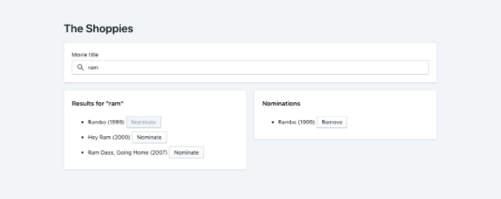
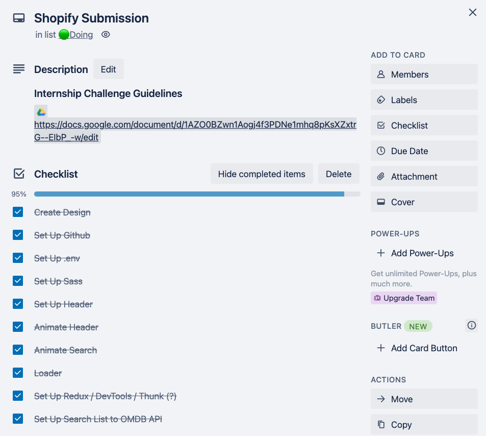

# the-shoppies
Movie nomination website created as part of the application process for the Shopify Front-End Developer Internship.
# [🔗 View Deployed Version](https://the-shoppies-gyk.netlify.app/)

## Table Of Contents
* [The Challenge](#The-Challenge) 
* [My Approach](#My-Approach) 
* [Tech Used](#Tech-Used) 
* [Feature Highlights](#Feature-Highlights)
* [Future Additions](#Future-Additions)

---
## The Challenge

Create a webpage that can search OMDB for movies, and allow the user to save their favourite films they feel should be up for nomination. When they've selected 5 nominees they should be notified they're finished.

### Requirements 
* Simple to use interface.
* The ability search the OMDB API and return a list of movies that show at least the title, release year and a button to nominate them. 
* Search results should only be of movies.
* Updates to the search terms should update the result list.
* If a movie has been nominated already, it's button should be disabled within in search results. 
* Nominated movies should move to their own "Nomination List".
* Movies in the nomination list should be able to be removed.
* Display a banner when the user has 5 nominations.

### Provided Reference Image 


### Extras
Improvements to design and functionality are allowed to be added in order to highlight passion and skills.

[Back To Top](#Table-Of-Contents)

---

## My Approach 

### 1. Feature list
Using Trello I created a checklist of the requirements and then some initial ideas I had for things to add. This let me keep on top of production against the deadline and quickly capture/prioritize new ideas while I was working. For this site I just used a single card, but for larger projects I would break up tasks into separate card on a larger kanban board. 

#### Key Features
* Ensure user friendly error handling for search
* Give users the option to search for series or movies 
* Create new copy (text) for the design that matches the marketing site
* Create a custom and dynamic responsive layout 
* Add CSS Animations throughout
* Have a winner be selected at the end 
* Create authentication so people can't view the winner page on their own
* Make app into a PWA 
* Have the nomination list persist with Local Storage 
* Show expanded information for nominated films 
* Have nominated films link to their IMDB page
* Use a Loader/Spinner when querying the API for search or nominating 
* Add Open Graph and Twitter assets for sharing to social media 




### 2 — Research
I knew from the beginning that one of the key areas I wanted to play with was the design and keep it within family of the existing brand. This way the nomination site would have the trust of the Shopify brand and the winner would carry more impact. (Plus I really love the branding and wanted an opportunity to apply it in a project.) 

The first places I checked were the [Shopify marketing site](https://shopify.com/) and the [Polaris design system site](https://polaris.shopify.com/). These were valuable to see what sort of layouts, color and typograpy were used. I also took note of the style of copywriting for main service page headlines and how there was an engaging theme of elements overlaying into other sections, breaking the grid.

I also attended a webinar hosted by Shopify that had 5 panelists talk about the application proccess, but more importantly how they approach design and development at Shopify. Being able to learn the context of projects was really important to them and being in a growth mindset. 4 months as intern goes by fast and they mentioned how important it was to take in as much as possible. 

This webinar helped validate for me that applying the context of the exiting brand would be a good direction and that showcasing the ability to adapt to new tech would also work in my favor. 

### 3 — Creating a new design 
Now that I had a feature list and design direction I leveraged Figma for the next stage of planning. Since I was going to build this application with React, I created a "React Component Flow" that showed what components would be needed and how they would be structured. This also made it easier later on the create the folder structure and quickly brainstorm when a new component was needed. 

Next I created the user interface that was tied to a design system. The design system held styles for typography and colors. It also housed Figma components that were built with Auto Layout and Variants. 

Creating these design assets upfront made the coding a lot easier, as many problem could be identified and solved in this initial stage.

#### [🔗 View Figma Designs](https://www.figma.com/file/XItcce2NssWnRXkztKDhDO/The-Shoppies?node-id=4%3A33)

### 4 — Development 
At this stage I had everything I needed to start coding and the above resources proved helpful throughout development. I decided on building the site in React and use Redux, SASS and CSS Animations to support it. These 3 technologies are all areas I can improve in and I wanted this project to be catalyst for growth, even whether it helps earn the internship or not. 

[Back To Top](#Table-Of-Contents)

---

## Tech Used
* React.js (Hooks)
* Axios
* OMDB API
* Dot ENV
* React Router
* Redux
* Redux-Thunk
* Node SASS
* CSS Animations
* CSS Grids
* Flexbox
* Figma
* PWA
* Local Storage
* Netlify
* Trello


[Back To Top](#Table-Of-Contents)


---

## Feature Highlights

### Responsive Layout 


Layouts are archived with CSS Grids, Flexbox, Transform and Relative/Absolute positioning. I used SCSS mixins and variables to standardize the media queries across the site and ensure an optimized layout for all screens. 

```scss
@mixin xxlMinBreakPoint {
    @media (min-width: #{$screen-xxl}) {
        @content;
    }
}

@mixin customMinBreakPoint($size) {
    @media (min-width: $size+'px') {
        @content;
    }
 }
```

### Animation Storage 
There are many css animations used across the site to introduce and exit difference elements. I created some manually and generated others with [animista.net](https://animista.net/). To help streamline the SCSS files I placed the actual keyframes into an "_animations.scss" partial file. This allowed animations to be re-used without repeating code and reduced the overall size of the main SCSS files. 

```
components
|— WinnerWrapper
|— — winnerWrapper.js <--- uses animation

sassStyles
|— _animations.scss <--- stores animation
|— _functions.scss
|— _global.scss
|— •••
```
 
### Debounce 
To ensure that multiple api calls are not made with each letter inputted, I used a debounce custom hook to delay the api call until the user finished typing.

```js
 // Sends search term to API
useEffect(() => {

    // Cancels search if nothing is inputted
    if (!searchTerm) {
        return;
    }

    // Send search term to Redux once the Denouncer Hook is ready
    if (debouncedSearchTerm) {
        searchOmdbApi(action.searchOmdb(searchTerm, searchSeries));
    }

}, [debouncedSearchTerm]);
```

### A Spinner/Loader Is Shown During API Calls
This helps the user know something is happening if the API doesn't respond right away. 

```jsx
 // Search Results Display
let searchResults = null;

 // If the person is currently searching...
if (searching) {

    // ...Then a loader will show until the api returns results
    if (searchLoadingStatus || nominationLoadingStatus) {
        searchResults = <Loader />
    } else {

        // Stores the MovieSearchMetaInfo component (which gets mapped through)
        searchResults = movieListArray && movieListArray.map((movie, index) => {

            // Checks if movie has been nominated already
            const isNominated = nominationList.find(result => result.Title === movie.Title)

            return <MovieSearchMetaInfo
                key={movie.imdbID}
                exitResults={triggerExitResults}
                title={movie.Title}
                year={movie.Year}
                type={movie.Type}
                index={index}
                disable={isNominated}
                handleClick={() => handleNominate(movie.Title, movie.Year)}
            />
        });
    }
}
```

### Series / Movie Switcher & Series Release Year Fix
Since some people pefer The Office over Star Wars, I felt it was important to also allow people to search series. However, this is a separated from the movie search, to follow the project requirements. 

First the Search Action Creator (using redux-thunk) checks to see if the user searching movies or a series. 

```jsx
// OMDB Movie API
let omdbUrl = null;

// Check to see the user media type preference
if (seriesToggle) {
    omdbUrl = `https://www.omdbapi.com/?s=${searchTerm}&type=series&apikey=${process.env.REACT_APP_OMDB_KEY}`;
} else {
    omdbUrl = `https://www.omdbapi.com/?s=${searchTerm}&type=movie&apikey=${process.env.REACT_APP_OMDB_KEY}`;
}
```

It then makes the API call. The response is run through several checks, which are described in the below comments.

```jsx
axios.get(omdbUrl)
    .then((res) => {
        const response = res.data;

        if (response.Response) {
            let resultList = response.Search;

            // Checks if the results list is an array to prevent an error
            if (Array.isArray(resultList)) {

                // Limits the search results to 3 if needed
                resultList = resultList.length > 3 ? resultList.slice(0, 3) : resultList;

                // Series that are still going don't come formatted nicely
                // This loop adds a "Present" to the end if needed
                // Some movies also come formatted incorrectly and they are fixed here
                resultList.forEach(result => {

                    // Creates an array of the year
                    let resultYearArray = result.Year.split('');

                    // If there is no end date this will add a "Present"
                    if (resultYearArray.length < 6
                        && result.Type === "series") {
                        let updatedResultYear = resultYearArray.concat("Present")

                        return result.Year = updatedResultYear.join("")
                    }

                    // If a movie has "-Present", this will remove it
                    if (resultYearArray.length > 4
                        && result.Type === "movie") {
                        let updatedResultYear = resultYearArray.slice(0, 4)

                        return result.Year = updatedResultYear.join("")
                    }
                });
            }

            // Sends the final array to another action creator that talks to the reducer
            dispatch(searchSucceeded(resultList))
        }
```

### Reducer Helper Functions 
Helper functions are used within the Reducer stores, to make the switch cases more streamline. 

```jsx
// Function example that contains some logic
const nominationSuccess = (state, action) => {
    let updatedNominationList = null;

    const movieAlreadyNominated = state.nominationList.find(result => result.Title === action.omdbResult.Title)

    if (movieAlreadyNominated) {
        updatedNominationList = state.nominationList;
    } else {
        updatedNominationList = state.nominationList.concat(action.omdbResult)
    }

    return updateObject(state, {
        loading: false,
        error: false,
        nominationList: updatedNominationList
    });
}

// Greatly streamlined switch case 
const reducer = (state = initialState, action) => {
    switch (action.type) {
        case actionTypes.NOMINATED_STARTED:
            return nominationStarted(state, action);
        case actionTypes.NOMINATED_SUCCESS:
            return nominationSuccess(state, action); // <--- one line used
        case actionTypes.NOMINATED_FAILED:
            return nominationFailed(state, action);
        case actionTypes.NOMINATION_CANCELED:
            return nominationCanceled(state, action);
        case actionTypes.NOMINATIONS_STORED:
            return nominationStored(state, action);
        case actionTypes.NOMINATIONS_COMPLETED:
            return nominationCompleted(state, action);
        case actionTypes.NOMINATIONS_CLEARED:
            return nominationCleared(state, action);
        default: return state;
    };
};
```


### Secondary API Call
The OMDB API was queiried again using Redux Thunk in an action creator, so that nominations can have complete movie details. (This is needed because when querying for a list of results only a few points of movie specific data is returned.)

```jsx
// Searches the API asynchronously 
export const queryOmdbNomination = (movieTitle, movieYear) => {

    return dispatch => {
        dispatch(nominationQueryStarted());

        // OMDB Movie API Query String
        const omdbUrl = `https://www.omdbapi.com/?t=${movieTitle}&y=${movieYear}&apikey=${process.env.REACT_APP_OMDB_KEY}`;

        // API Request
        axios.get(omdbUrl)
            .then((res) => {
                const response = res.data;
                dispatch(nominationQuerySucceeded(response));

            })
            .catch((error) => {
                dispatch(nominationQueryFailed(error));
            })
    }

}
```


### IMDB Links
Nominated films allow you to open their page in IMDB. This is achieved by taking the `imdbId` and dynamically inserting it into the  `<a href="">` with it's `""` removed.

```jsx
<a
    className="nom-row__imdb-link"
    href={`https://www.imdb.com/title/${props.imdbID.replace(/['"]+/g, '')}`}
    target="_blank"
    rel="noreferrer noopener"
>
```


### Genre Cut Off
To help control the layout for nominated movies, their genres have been restricted to the first 3. 

```jsx
let updatedGeneres = null;
let propsArray = props.genres.split(" ");

// Shortens generes to 3 items 
if (propsArray.length > 3) {
    updatedGeneres = propsArray.splice(0, 3).join(" ").slice(0, -1);
} else {
    updatedGeneres = props.genres;
}
```

### Local Storage 
For a better user experience, nominated movies and the winner preserve their data in local storage. That way nothing goes away when the user refreshes the screen. 

The nomination container component looks out newly nominated movies and then stores.
```jsx
// Pulls Nomination List from local storage
useEffect(() => {

    const localData = localStorage.getItem('nominationList');

    if (localData) {
        setNominationList(action.storeAllNominations(JSON.parse(localData)));
    }

}, [setNominationList])


// Saves resultsArray to local storage
useEffect(() => {
    localStorage.setItem('nominationList', JSON.stringify(nominationList));

}, [nominationList])
```

When the user is ready to view the winners, the movies are shuffled and this new list is stored in local storage.
```jsx
// Shuffles the nomination list to pick a winner
shuffle(localStorageList);
localStorage.setItem('winnerList', JSON.stringify(localStorageList));
```

The winner container component then checks that new local storage list 
```jsx
const winnerList = JSON.parse(localStorage.getItem('winnerList'));
```

Lastly, both lists are removed from local storage, when the user clicks the reset button. 
```jsx
localStorage.removeItem("winnerList");
localStorage.removeItem("nominationList");
```

[Back To Top](#Table-Of-Contents)

---

## Future Additions
* Bug: On firefox the content sometimes causes sideways scrolling for a few seconds. 
* Animation: Currently I hide overflow for the main wrapper, while the green nomination block comes in, then after a second turn it back on. I would like to find a different solution for this in the future. This can take a hit on performance since `overflow` applies earlier in the page rendering process, requiring more resources.
* Sharing: I would like to add a way to share the winner results to social media.  

[Back To Top](#Table-Of-Contents)